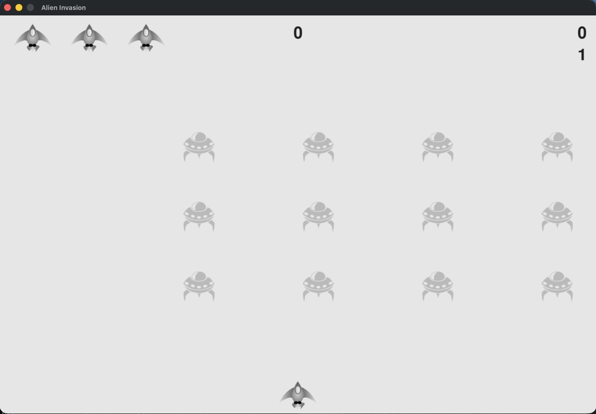

# Alien-Invasion-Game



In Alien Invasion, players pilot a ship to defend Earth from waves of descending aliens. Using arrow keys to move and the spacebar to fire, you must destroy alien fleets before they reach the bottom. Each wave grows faster and deadlier, testing reflexes and strategy. Score points, advance levels, and aim for the high score!

## How to Play

### Controls
- **Arrow Keys**: Move ship left/right
- **Spacebar**: Fire bullets
- **Q**: Quit game

### Rules
- Shoot aliens before they reach your ship
- Lose 3 ships and the game ends
- Each wave gets faster and more challenging

## Installation & Setup

1. **Clone the repository**
   ```bash
   git clone <your-repo-url>
   cd Alien-Invasion-Game
   ```

2. **Create and activate virtual environment**
   ```bash
   python3 -m venv venv
   source venv/bin/activate  # On Windows: venv\Scripts\activate
   ```

3. **Install dependencies**
   ```bash
   pip install -r requirements.txt
   ```

## Running the Game

```bash
python alien_invasion/alien_Invasion.py
```

## Screenshots